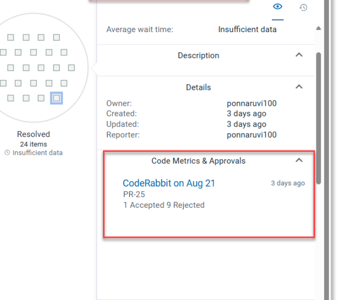

# CodeRabbit - Overview

The CodeRabbit plug-in designed to sync code review metrics into DevOps Velocity. It operates primarily through a scheduled background event that queries the CodeRabbit API and uploads the results for insights analytics.

## Pre-requisite

* The CodeRabbit plugin exclusively provides review metric data, which it uploads to DevOps Velocity as GenAI PR Event metrics.
* **GitHub Integration Required**: Because CodeRabbit only supplies the metrics, you must also integrate the GitHub plugin to fetch the corresponding pull request details.
Github plugin version that supported is 1.5.15 or later
* **Data Linking (VSM)**: Once both plugins are successfully integrated, the system will automatically link the PR data with the review metrics. These linked data points will then appear in the Value Stream Map (VSM) dot history under the Code Metrics and Approvals category.

## Compatibility

The table below lists the compatible versions of the CodeRabbit plug-in and DevOps Velocity:

| DevOps Velocity Version | CodeRabbit plug-in version |
| --- | --- |
| 5.2.7 or later | 1.0.1 |

## Versions

The DevOps Velocity plug-in images are located in DockerHub. For available versions, see the [UrbanCode DockerHub](https://hub.docker.com/r/urbancode/ucv-ext-coderabbit/tags).

## History

### Version 1.0.1

* **Initial release**: The CodeRabbit plug-in sync code review data (Accepted and Rejected comments) into DevOps Velocity as GenAI PR Events metrics.