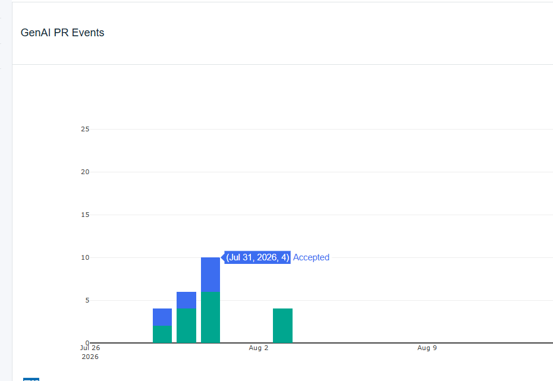
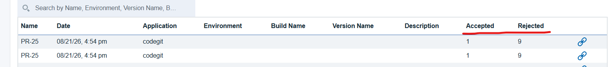

# CodeRabbit - Usage

To use the CodeRabbit plug-in, the plug-in must be loaded, and an instance must be created before you configure the plug-in integration. You can then define configuration properties in the user interface or in a JSON file.

## Integration type

The CodeRabbit plug-in supports scheduled events integration that are listed in the following table:

| Name | Description |
| --- | --- |
| Sync CodeRabbit Review Metrics | Query CodeRabbit review metrics and sync to Velocity |

## Integration

To install the plug-in, perform the following steps:

1. In DevOps Velocity, click **Settings** > **Integrations** > **Available**.
2. In the **Action** column for the CodeRabbit plug-in, click **Install**.

There are two methods to integrate the plug-in:

1. Using the user interface.
2. Using a JSON file

The tables in the Configuration properties topic describe the properties used to define the integration.

## Integrating the plug-in by using user interface

To integrate the plug-in using the user interface, perform the following steps:

1. In DevOps Velocity, click **Settings** > **Integrations** > **Installed**.
2. In the **Action** column for the CodeRabbit plug-in, click **Add Integration**.
3. On the Add Integration dialog, enter the values for the fields to configure the integration and define communication.
4. Click **Add**.

## Integrating the plug-in by using JSON file

The JSON file contains the information for creating a value stream. Within the JSON file is a section for integrations. It is in this section that plug-in properties can be defined. Refer to the JSON sample code in the Configuration Properties section.

To integrate the plug-in using JSON, perform the following steps:

1. On the Home page, click Value Streams and select the required value stream. 
2. Click **wrench icon**, and then select **Edit value stream** to modify the JSON file in the code or tree view editors.
Alternatively, you can also click the Download JSON to download the JSON file, and then select the Import JSON to upload the revised JSON file.
3. Edit the integration information in the JSON file to add the plug-in configuration properties. For more details, see the JSON sample code in the Configuration Properties
4. Click **Save**.

## Data Mapping and Metrics

* The CodeRabbit plug-in exclusively provides review metric data and uploads to DevOps Velocity as GenAI PR Event metrics.
* **Data Linking (VSM)**: After GitHub and CodeRabbit plugins are successfully integrated, the system will automatically link the PR data with the review metrics. These linked data points will then appear in the Value Stream Map (VSM) dot history under the Code Metrics and Approvals category.


 
* Incoming data is mapped to the **GenAI PR Events** metric definition.  
* The plugin logs the number of **Accepted** comments and calculates **Rejected** comments by subtracting the accepted count from the total posted comments




## Configuration properties

The following tables describe the properties used to configure the integration. Each table contains the field name when using the user interface and the property name when using a JSON file.

* The General Configuration Properties table describes configuration properties used by all plug-in integrations.
* The CodeRabbit Configuration Properties table describes the configuration properties that define the connection and communications with the CodeRabbit server. When using the JSON method to integrate the plug-in, these properties are coded within the `properties` configuration property.

### General Configuration table

| Name | Description | Required | Property Name |
| --- | --- | --- | --- |
| NA | The version of the plug-in that you want to use. To view available versions, see the [UrbanCode DockerHub](https://hub.docker.com/r/urbancode/ucv-ext-coderabbit/tags). If a value is not specified, the latest version is used. | No | image |
| Integration Name | An assigned name to the value stream. | Yes | name |
| Logging Level | The level of Log4j messages to log. Valid values are: all, debug, info, warn, error, fatal, off, and trace. The default is info. | No | loggingLevel |
| NA | List of plug-in configuration properties used to connect and communicate with the CodeRabbit server. Enclose the properties within braces. | Yes | properties |
| NA | The name of the tenant. | Yes | tenant_id |
| | Unique identifier assigned to the plugin. The value for the CodeRabbit plugin is ucv-ext-coderabbit. | yes | type |
| DevOps Velocity User Access Key | Unique identifier assigned to the plug-in. The value for the CodeRabbit plug-in is `ucv-ext-coderabbit` | Yes | NA |

### CodeRabbit Configuration Properties table

| Name | Type | Description | Required | Property Name |
| --- | --- | --- | --- | --- |
| CodeRabbit API URL | String | The CodeRabbit API base URL. Default: https://api.coderabbit.ai | Yes | apiUrl |
| API Key | Secure | CodeRabbit API key sent as x-coderabbitai-api-key header | Yes | apiKey |
| Application Name | String | The application name used to identify the source of the data in Velocity | Yes | applicationName |
| Repository IDs (Comma Separated List) | Array | Optional Git provider repository IDs used for filtering CodeRabbit metrics | No | repositoryIds <br><br> **Note**: You must configure this field using exact Repository IDs rather than repository names. The CodeRabbit API does not currently support resolving repository names to IDs. Explicit IDs are required until CodeRabbit releases an API update that handles name-to-ID mapping. |
| Team Space Id | FilterableSelect | The teamspace associated with the integration. | No | teamspaceId |
| Team Id | FilterableSelect | The teams associated with the integration. | No | teamId |
| Workflow ID | String | The value stream with which this metric is associated. | No | workflowId |

## JSON sample code

You can use the following example as a template to include the CodeRabbit plug-in integration into the JSON file. You must copy and paste the template into the JSON file and make the appropriate changes.

```json

"integrations": [ {
"type": "ucv-ext-coderabbit",
"tenant_id": "*tenantid*",
"name": "CodeRabbit_Plugin ",
"properties": {
    "apiUrl": "<CodeRabbit API URL>",
    "apiKey": "<CodeRabbit API Key>",
    "applicationName": "<Application Name>",
    }
} ]
```