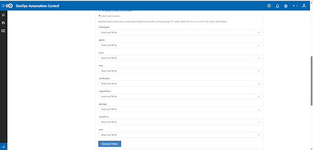

# DevOps Control - Usage

To use the DevOps Control plug-in, the plug-in must be loaded, and an instance created before you can configure the plug-in integration. You define configuration properties in the user interface or in a JSON file.

## Integration type

The DevOps Control plug-in supports scheduled events integration which are listed in the following table.

| Name | Description | Synchronization Interval |
| --- | --- | --- |
| syncControlPullRequestsEvent | Queries the DevOps Control repository for pull requests. | 5 Minutes |
| syncControlCommitsEvent | Queries the DevOps Control repository for commits. | 5 Minutes |

## Integration

To install the plug-in, perform the following steps:

1. In IBM DevOps Velocity, click **Settings** > **Integrations** > **Available**.
2. In the **Action** column for the DevOps Control plug-in, click **Install**.

There are two methods to integrate the plug-in:

1. Using the user interface
2. Using a JSON file

The tables in the Configuration Properties section describe the properties used to define the integration.

## Integrating the plug-in by using user interface

The tables in the Configuration properties topic describe the properties used to define the integration.

To integrate the plug-in using the user interface, perform the following steps:

1. In IBM DevOps Velocity, click **Settings** > **Integrations** > **Installed**.
2. In the **Action** column for the DevOps Control plug-in, click **Add Integration**
3. On the Add Integration dialog, enter the values for the fields to configure the integration and define communication.
4. Click **Add**.

## Integrating the plug-in by using JSON file

The JSON file contains the information for creating a value stream. Within the JSON file is a section for integrations. It is in this section that plugin properties can be defined. Refer to the JSON sample code in the Configuration Properties section.

To integrate the plug-in using a JSON, perform the following steps:

1. Navigate to **value stream page**, and then click the necessary **value stream**.
2. Click  **wrench icon**, and then Select **Edit value stream** to modify the JSON file in the code or tree view editors.
Alternatively, you can also click Download JSON option to download the JSON file, and then select the Import JSON option to upload the revised JSON file.
3. Edit the integration information in the JSON file to add the plug-in configuration properties. Refer to JSON sample code in the Configuration Properties for more details.
4. Click **Save**.

## Minimum permission to integrate with DevOps Control

The access token generated from DevOps Control server requires the full control of repositories permission to connect to the Control.



## Configuration properties

The following tables describe the properties used to configure the integration. Each table contains the field name when using the user interface and the property name when using a JSON file.

* The General Configuration Properties table describes configuration properties used by all plug-in integrations.
* The DevOps Control Configuration Properties table describes the DevOps Control configuration properties that define the connection and communications with the DevOps Control server.

Some properties might not be displayed in the user interface, to see all properties enable the **Show Hidden Properties** field.

### General Configuration Properties table

| Name | Description | Required | Property Name |
| --- | --- | --- | --- |
| NA | The version of the plug-in that you want to use. To view available versions, click the Version History tab. If a value is not specified, the latest version is used. | No | image |
| Integration Name | An assigned name to the value stream. | Yes | name |
| Logging Level | The level of Log4j messages to display in the log file. Valid values are all, debug, info, warn, error, fatal, off, and trace. | No | loggingLevel |
| NA | List of configuration properties used to connect and communicate with the DevOps Control server. Enclose the properties within braces. | Yes | properties |
| NA | The name of the tenant. | Yes | tenant_id |
| NA | Unique identifier assigned to the plug-in. The value for the DevOps Control plug-in is ucv-ext-control. | Yes | type |
| DevOps Velocity User Access Key | An auto-generated user access key provides credentials for communicating with the IBM DevOps Velocity server. | Yes | NA |

### DevOps Control Configuration Properties table

| Name | Type | Description | Required | Project Name |
| --- | --- | --- | --- | --- |
| API URL | String | The URL for the REST API v3 of the DevOps Control application instance (add /api/v1 at the end of base url). | Yes | apiUrl |
| Organization | String | The organization name of the DevOps Control repository. | Yes | organization |
| Repositories | Array | List of DevOps Control Repository names (separated by comma). Regular expression is enabled (Example: ucv-ext-*, repo-name*, *repo*-abc) | Yes | repositories |
| Branch | String | DevOps Control repositories branch, the branch to pull commits from. | No | branch |
| Personal access token | Secure | The token to use to authenticate with the DevOps Control repository. | Yes | token |
| Additional branches | Array | List of Branches (separated by comma) to collect commits from besides the main one. Leave blank if not needed | No | otherBranches |
| Proxy Server | String | The URL of the proxy server including the port number. | No | proxyServer |
| Proxy User Name | String | The username used to authenticate with the proxy server. | No | proxyUsername |
| Proxy Password | String | The password used to authenticate with the proxy server. | No | proxyPassword |
| User Access Key | Secure | User access key for authentication with this server | No | ucvAccessKey |

### JSON code example

The following sample code can be used as a template to define the integration within the JSON file for a value stream. Copy and paste the template into the JSON file Integration section and make the appropriate changes.

```json

"integrations":[ {
    "type":"ucv-ext-control",
    "tenant_id":"tenant-id",
    "name":"control-integration-name",
    "properties":{
        "organization":"organization",
        "repositories":[ 
            "repo1",
            "repo2",
            "repo3"
        ],
        "apiUrl":"control-api-url",
        "token":"generated-token",
        "ucvAccessKey":"generated-access-key",
        "proxyServer": "*proxy_server_url*",
        "proxyUsername": "*proxy_server_user_name*",
        "proxyPassword": "*proxy_server_password*"
    }
} ]

```

|Back to ...||Latest Version|DevOps Control |||
| :---: | :---: | :---: | :---: | :---: | :---: |
|[All Plugins](../../index.md)|[Velocity Plugins](../README.md)|[1.0.5-File 1 ](https://raw.githubusercontent.com/UrbanCode/IBM-UCV-PLUGINS/main/files/ucv-ext-control/ucv-ext-control%3A1.0.5.tar.7z.001)[and 1.0.5-File 2](https://raw.githubusercontent.com/UrbanCode/IBM-UCV-PLUGINS/main/files/ucv-ext-control/ucv-ext-control%3A1.0.5.tar.7z.002)|[Readme](README.md)|[Overview](overview.md)|[Downloads](downloads.md)|
