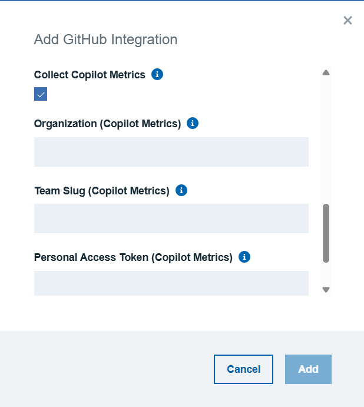
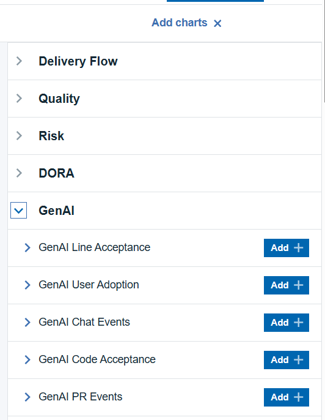

### GitHub Copilot Documentation

## Overview

The GitHub Copilot Metrics integration enables customers to automatically collect and analyze Copilot usage insights for their organization. This feature retrieves user activity, engagement levels, language-specific completions, and other Copilot adoption metrics directly from the GitHub API and syncs them into Velocity.

This helps organizations track how developers are using AI-assisted coding and measure productivity impact through structured metrics.

## Configuration Structure

The GitHub Copilot Metrics integration fetches structured JSON data from the Copilot Metrics API and extracts multiple metric categories.
Velocity processes the API response and converts it into five different metric datasets:

### User Adoption Metrics

These fields come directly from the API response:

| Field	| Description |
|-------| ------------|
| date | The date of the metric record |
| Active | Users who interacted with Copilot |
| Engaged | Users who accepted or modified Copilot suggestions |

**dataset**: GenAI User Adoption

### Line Acceptance Metrics

These fields come directly from the API response:

| Field	| Description |
|-------| ------------|
| date | The date of the metric record |
| suggested | Total lines Copilot suggested across all editors/languages |
| Accepted | Total lines accepted by the user |

**dataset**: GenAI Line Acceptance

### Code Acceptance Metrics (Suggestion Acceptance)

These fields come directly from the API response:

| Field	| Description |
|-------| ------------|
| date | The date of the metric record |
| suggestions | Number of code suggestions generated by Copilot |
| acceptances | Number of suggestions accepted |

**dataset**: GenAI Code Acceptance

### Chat Events Metrics

These fields come directly from the API response:

| Field	| Description |
|-------| ------------|
| date | The date of the metric record |
| Total Chats | Total chat prompts created by users |
| Chat Insertion Events | Chat-to-code insertion actions |
| Chat Copy Events | Chat response copy events |


**dataset**: GenAI Chat Events

### Pull Request Summary Metrics

These fields come directly from the API response:

| Field	| Description |
|-------| ------------|
| date | The date of the metric record |
| pr_summaries_created | Number of PR summaries generated by Copilot |

**dataset**: GenAI PR Events

# Example Copilot Metric Record

```
{
  "date": "2025-06-11",
  "total_active_users": 40,
  "total_engaged_users": 20,
  "copilot_ide_code_completions": {
    "total_engaged_users": 20,
    "languages": [
      { "name": "python", "total_engaged_users": 10 },
      { "name": "ruby", "total_engaged_users": 5 },
      { "name": "javascript", "total_engaged_users": 5 }
    ]
  }
}
```

# Explanation:

* **date**: Metric aggregated per day

* **total_active_users**: Anyone who used Copilot

* **total_engaged_users**: Anyone who engaged with Copilot suggestions

* **languages**: Breakdown of engaged users per programming language

Velocity collects and stores this data for reporting and trend analysis.

# Pre-requisites 

To use the GitHub Copilot Metrics integration, the following requirements must be met: 

## GitHub Organization Administrator Access 

You must have organization-level admin access to enable and configure Copilot API usage. 

## Copilot API Access Approval 

Your organization must request and obtain Copilot API access from GitHub. Without this approval, Copilot metrics cannot be collected. 

## Required Tokens 

Personal Access Tokens must include Copilot Admin permissions. Tokens without these scopes will fail. 

## IT / Security Team Approval 

Copilot Admin API permissions typically require approval from your IT or Security teams. 

# Authentication Requirements

Enable **Collect Copilot Metrics** to collect Copilot metrics

Once Enabled, you need to fill the following details

* Organization Name
* Team Slug
* Personal Access Token ( Copilot)




The following Copilot metrics can be added and displayed within the Velocity insights section. 

* GenAI Line Acceptance
* GenAI User Adoption
* GenAI Chat Events
* GenAI Code Acceptance
* GenAI PR Events 

**NOTE:**
This feature is provided as a **Tech Preview**. Organizations intending to enable it must obtain GitHub Copilot API access approvals and generate tokens with the required Copilot permissions. Without these approvals and the appropriate tokens, Copilot metrics cannot be collected. 
