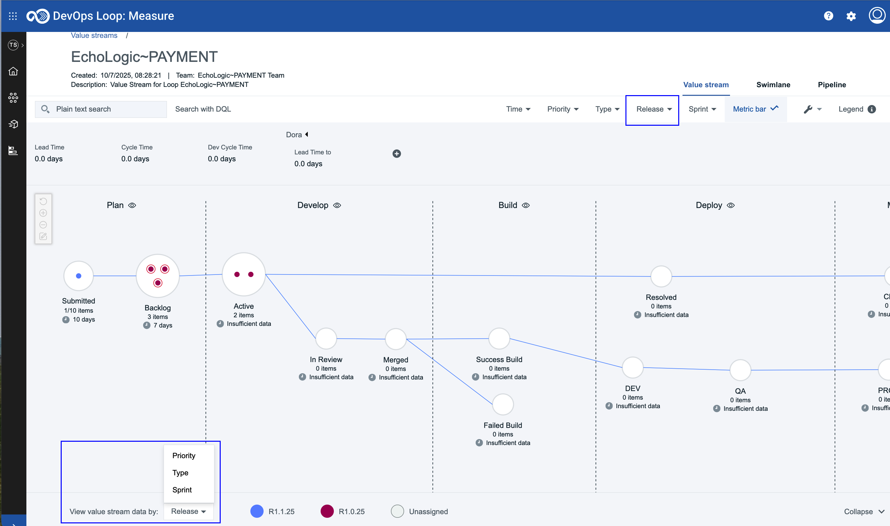

# DevOps Plan - Overview

## Overview

The plug-in imports work items as issues from DevOps Plan server into IBM DevOps Velocity. The data between IBM DevOps Velocity and DevOps Plan synchronizes for every 5 minutes by default. For quick sync up of data, you must disable and enable the integration in Integration page.

## Compatibility

The table below lists the compatible versions of the DevOps Plan plugin and IBM DevOps Velocity:

| IBM DevOps Velocity Version | DevOps Plan plugin version |
| --- | --- |
| 5.1.9 | 1.2.3, 1.2.2, 1.2.1 |
| 3.0.0 | 1.1.58, 1.1.57, 1.1.55, 1.1.52 |

DevOps plan server 1.0.14 or later.

## Prerequisites

You must have completed the following tasks before you integrate the DevOps Plan plug-in in:
1. Created an application in a teamspace.
2. Created a project in DevOps Plan with the following work statuses:
* Submitted
* Backlog
* Active
* Resolved
* Closed
3. Generated a personal access token in your DevOps Plan account.

## Versions

DevOps Velocity plug-in images are located in DockerHub. To view available versions, see the [UrbanCode DockerHub](https://hub.docker.com/r/urbancode/ucv-ext-compass/tags).

### History

### Version 1.2.3

* **Bug fix**: Release tab on filter bar and Releases option in Type selection does not appears on the VSM page filters.

* **Note**: After upgrading from 1.2.2 to 1.2.3, you need to perform a full resync to make the releases filter visible on the VSM page.

### Version 1.2.2

* **Enhancement**: The plugin has been updated to use an optimized API, enhancing data retrieval and normalization performance. It now runs faster and consistently within the expected time frame.

### Version 1.2.1

* **Enhancement**: Added teamId and teamspaceId for integration properties for data access control support

### Version 1.1.58

* **Removal of timezone field**: Previously, the timezone was configured during plug-in integration setup in Velocity. This option has now been removed, and the timezone is instead retrieved directly from the API.

### Version 1.1.57

* **Feature enhancement**: Enhanced the DevOps Plan plug-in integration with Velocity by automating field mapping. This eliminates the need for manual configuration, ensuring a smoother and more efficient integration experience.

### Version 1.1.55

* Updated plug-in log messages.

#### Version 1.1.52

* Initial release
