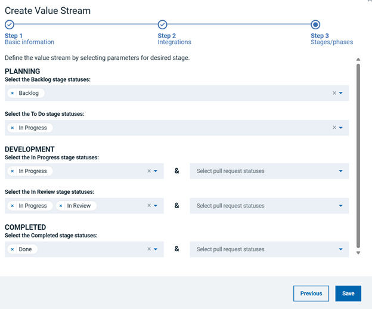
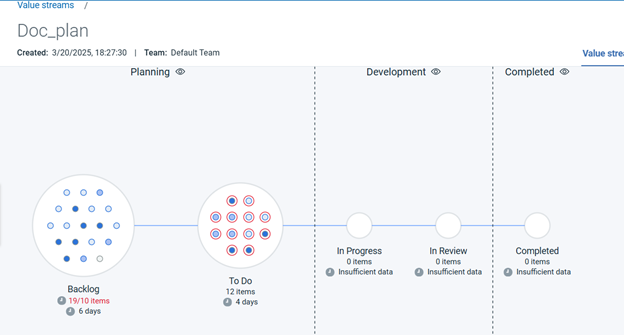

# DevOps Plan - Usage

To use the Plan plug-in, the plug-in must be loaded and an instance created before you can configure the plug-in integration. You define configuration properties in the user interface or in a JSON file.
The DevOps Plan plug-in imports and synchronize issues from an DevOps Plan server into an IBM DevOps Velocity server.

## Integration type

The DevOps Plan plug-in supports scheduled events integration which are listed in the following table.

| Name | Description |
| --- | --- |
| syncCompassIssueEvent | Query the DevOps Plan server for issues in a project. |

## Integration

There are two methods to integrate the plug-in:

1. Using the user interface
2. Using a JSON file

The tables in the Configuration properties topic describe the properties used to define the integration.

### using the user interface

1. On the Home page, click **Settings** > **Integrations** > **Available** tab.
2. Select **DevOps Plan** from the list, and then click **Install**.
The Add DevOps Plan Integration dialog is displayed.
3. Specify the properties by referring to the following table:

The following table lists the required fields that you must provide to integrate the DevOps Plan plug-in.

| Fields | Action |
| --- | --- |
| Integration name | Enter the name for the integration. |
| URL | Enter the URL of DevOps Plan server. |
| Team Space | Enter the Team Space Id of DevOps Plan tenant. |
| Application Name | Enter the name of the DevOps Plan application. |
| Personal Access Token | Enter the personal access token that you generated in your DevOps Plan account. |
| Logging level | Select ALL from the drop-down list. |

4. Click **Add** to add the integration.

The integration is listed on the configuration page and Status field displays that the integration is Online. If the integration is not successful, the Status field displays that integration is Failed. You must use the View log option to troubleshoot the integration.

5. Synchronization of plug-in is set to 5 minutes by default. You can disable synchronization by using toggle icon in the Disable/Enable section on the Configured tab.

### using a JSON file

The JSON file contains the information for creating a value stream. Within the JSON file is a section for integrations. It is in this section that plug-in properties can be defined. Refer to the sample JSON code in Configuration Properties section.

To integrate the DevOps Plan plug-in using a JSON, perform the following steps:

1. Navigate to **value stream page**, and then click the necessary value stream.
2. Click **wrench** icon, and then Select **Edit value stream** to modify the JSON file in the code or tree view editors.
3. Alternatively, you can also click **Download JSON option** to download the JSON file, and then select the **Import JSON option** to upload the revised JSON file.
4. Edit the integration information in the JSON file to add the plug-in configuration properties. Refer to JSON sample code in the Configuration Properties section more details.
5. Click **Save**.

## Stage Queries

When using a vsm.json file to configure, it includes multiple stages. Stages are defined as objects within a stages array. The stages array is part of a phase object within a phases array. You can modify both phases and stages to match your own process. All stage queries are empty by default. You can add and remove phases, stages, and stage queries for your entire value stream.

The following is a simple example.

```

"phases": [
  {
    "name": "Planning",
    "description": "Preparing Defects for Work",
    "stages": [
      {
        "name": "Submitted",
        "query": "issue.status=Submitted",
        "description": "",
        "wipLimit": null,
        "gates": null
      },
      {
        "name": "Postponed",
        "query": "issue.status=Postponed",
        "description": "",
        "wipLimit": null,
        "gates": null
      },
      {
        "name": "Duplicates",
        "query": "issue.status=Duplicates",
        "description": "",
        "wipLimit": null,
        "gates": null
      }
    ]
  },
  {
    "name": "In-Progress",
    "description": "Work Process to Resolve Defects",
    "stages": [
      {
        "name": "Opened",
        "query": "issue.status=Opened",
        "description": "",
        "wipLimit": null,
        "gates": null
      },
      {
        "name": "Assigned",
        "query": "issue.status=Assigned",
        "description": "",
        "wipLimit": null,
        "gates": null
      }
    ]
  },
  {
    "name": "Completed",
    "description": "Defect Tracking after Work Completed",
    "stages": [
      {
        "name": "Resolved",
        "query": "issue.status=Resolved",
        "description": "",
        "wipLimit": null,
        "gates": null
      },
      {
        "name": "Closed",
        "query": "issue.status=Closed",
        "description": "",
        "wipLimit": null,
        "gates": null
      }
    ]
  }
]

```

## DQL Queries
DevOps Plan queries are based on issue objects. These objects have standardized IBM DevOps Velocity fields. Some standard fields are automatically mapped, while others are defined by custom mapping. Aside from standard fields, the DevOps Plan issue object also contains a rawIssue field that is unique to DevOps Plan.

```
issue.type=Defects
issue.owner=“John Bret”
issue.status=Assigned
issue.id=SAMPL000000012
issue.project.name=Classic
issue.rawIssue.customer=“Customer A”

```
### To create value stream

Perform the following steps to create a value stream

1. On the Velocity Home page, click **Create value stream**.
2. Perform the following steps in Step 1.
Specify the properties for the selected step by referring to the following table:
3. Select the **Application Lifecycle Management** Integration from the list in Step 2 Integrations dialog, and then click **Next**.
4. Select the phases for Planning, Development, and Completed in Step 3 Stages/Phases dialog.


5. Click **Save**.
A value stream is created.
The DevOps Plan project is integrated into the value stream. All the work items are imported to IBM DevOps Velocity and you can access project data and manage issues. Each dot in the value stream page represents a card. Select the dot to display a card with information about the dot, including its history.



## Configuration properties

The following tables describe the properties used to configure the integration. Each table contains the field name when using the user interface and the property name when using a JSON file.

* The General Configuration Properties table describes configuration properties used by all plug-in integrations.
* The DevOps Plan Configuration Properties table describes the DevOps Plan configuration properties that define the connection and communications with the DevOps Plan server.

Some properties might not be displayed in the user interface, to see all properties enable the **Show Hidden Properties** field.

### General Configuration properties

| Name | Description | Required | Property Name |
| --- | --- | --- | --- |
| Image | The version of the plug-in that you want to use. To view available versions, click the Version History tab. If a value is not specified, the latest version is used. | No | image |
| Integration Name | An assigned name to the value stream. | Yes | name |
| Logging Level | The level of Log4j messages to display in the log file. Valid values are all, debug, info, warn, error, fatal, off, and trace. | No | loggingLevel |
| NA | List of configuration properties used to connect and communicate with the DevOps Plan server. Enclose the properties within braces. | Yes | properties |
| Tenant ID | The name of the tenant. | Yes | tenant_id |
| NA | Unique identifier assigned to the plug-in. The value for the DevOps Plan plug-in is ucv-ext-compass | Yes | type |

### DevOps Plan Configuration Properties

| Name | Type | Description | Required | Property Name |
| --- | --- | --- | --- | --- |
| URL | String | The URL of the DevOps Plan Application. | Yes | serverUrl |
| Personal Access Token | Secure | Personal Access Token to authenticate with an application in DevOps Plan. |  Yes | pat |
| Team Space | String | Team Space Id of the DevOps Plan tenant. | Yes | repo |
| Application Name | String | The name of the DevOps Plan Application. | Yes | db |
| Import issues or work items from a specified number of months | String | Issues or work items are imported for the specified number of months when the plug-in runs for the first time. | No | since |

### JSON code sample

The following example can be used as a template to include the DevOps Plan plug-in integration into the JSON file. Copy and paste the template into the JSON file and make the appropriate changes.

**Example integration for type Defect**

```

"integrations": [
  {
    "type": "ucv-ext-compass",
    "tenant_id": "<Tenant Id>",
    "name": "<Integration-Name>",
    "disabled": false,
    "properties": {
      "_userAccessKey": "<User Access Key>",
      "serverUrl": "<devops-plan-server-url>",
      "pat": "<personal-access-token>",
      "repo": "<repo>",
      "db": "<db>",
      "since": "<since>"
    }
  }
]

```

**Example integration for type Feature**

```

"integrations": [
  {
    "type": "ucv-ext-compass",
    "tenant_id": "<Tenant Id>",
    "name": "<Integration-Name>",
    "disabled": false,
    "properties": {
      "_userAccessKey": "<User Access Key>",
      "serverUrl": "<devops-paln-server-url>",
      "pat": "<personal-access-token>",
      "repo": "<repo>",
      "db": "<db>",
      "since": "<since>"
    }
  }
]

```

**Example integration for type Story**

```

"integrations": [
  {
    "type": "ucv-ext-compass",
    "tenant_id": "<Tenant Id>",
    "name": "<Integration-Name>",
    "disabled": false,
    "properties": {
      "_userAccessKey": "<User Access Key>",
      "serverUrl": "<devops-plan-server-url>",
      "pat": "<personal-access-token>",
      "repo": "<repo>",
      "db": "<db>",
      "since": "<since>"
    }
  }
]

```


|Back to ...||Latest Version|DevOps Plan |||
| :---: | :---: | :---: | :---: | :---: | :---: |
|[All Plugins](../../index.md)|[Velocity Plugins](../README.md)|[1.1.58-File 1 ](https://raw.githubusercontent.com/UrbanCode/IBM-UCV-PLUGINS/main/files/ucv-ext-compass/ucv-ext-compass%3A1.1.58.tar.7z.001)[and 1.1.58-File 2](https://raw.githubusercontent.com/UrbanCode/IBM-UCV-PLUGINS/main/files/ucv-ext-compass/ucv-ext-compass%3A1.1.58.tar.7z.002)|[Readme](README.md)|[Overview](overview.md)|[Downloads](downloads.md)|
