# YAML Executor - Steps

## Importing YAML configuration file into DevOps Velocity

Import the YAML configuration file into DevOps Velocity by using any one of the following methods:

### Method 1: Using GitHub plug-in

Integrate DevOps Velocity with a GitHub repository that contains the ucv.yml file to import the YAML configuration file into DevOps Velocity.

Perform the following steps to import the YAML configuration file using GitHub plug-in:

1. Log in to DevOps Velocity.
2. Click **Settings>Integrations**.
3. In the Installed tab, click **Add Integration** for the installed GitHub plug-in.    
   **Note:** If the GitHub plug-in is not installed, go to Available tab and click Install for GitHub Plug-in.

   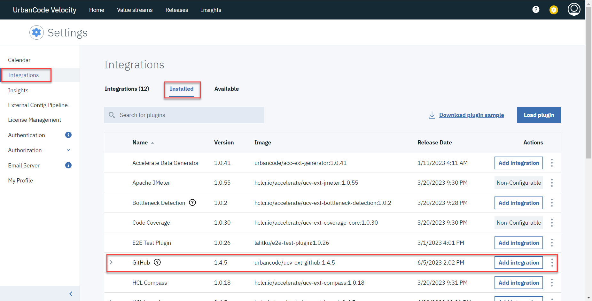
5. Enter the details in the required fields to add GitHub integration. 

   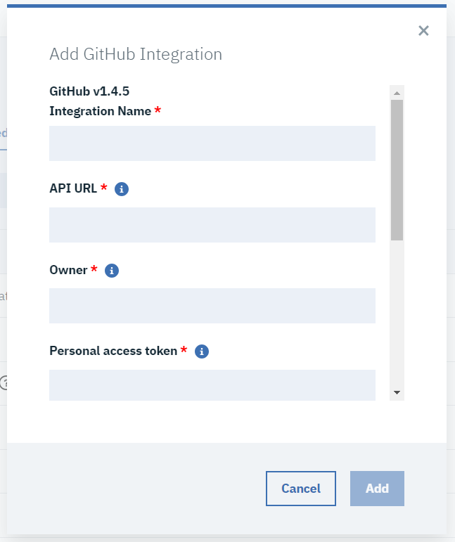
6. Click **Add** to save the details and enable the integration.
   
   The YAML configuration file from the GitHub repository is automatically synced to DevOps Velocity and displayed under Settings>External config pipeline.

### Method 2: Using user interface

You can import the YAML configuration file into DevOps Velocity using user interface if it is not hosted in a GitHub repository.

Perform the following steps to add YAML configuration file using user interface:

1. Log in to DevOps Velocity.
2. Click **Settings>External config pipeline**.
3. Click **Download sample yaml** to download the sample YAML file.
4. Edit the sample file with the actual values of your configuration.
5. Click **Add new config file**.

   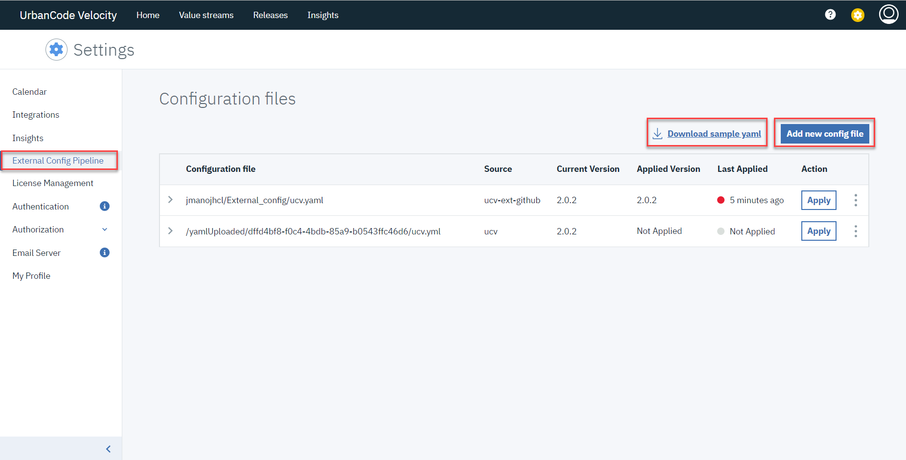
   Add New Config dialog opens.
7. Click **Choose file** to select the edited file.

   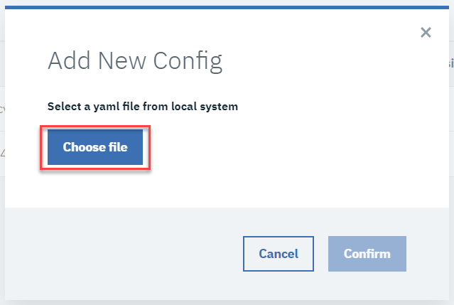
8. Click **Confirm** to upload the file.

   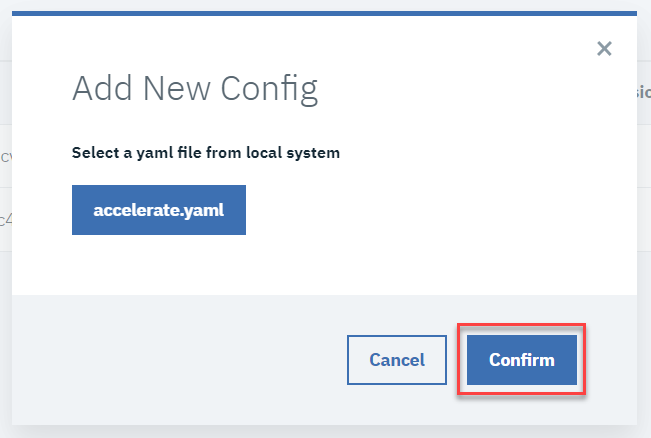

    The uploaded YAML configuration file is displayed in the list. 

   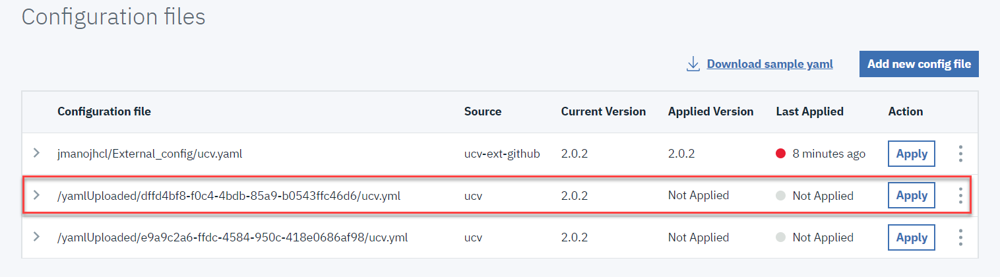
10. To edit the existing YAML configuration file, perform the following steps:
    1. Click overflow menu of the YAML configuration file and then click **Edit**.

       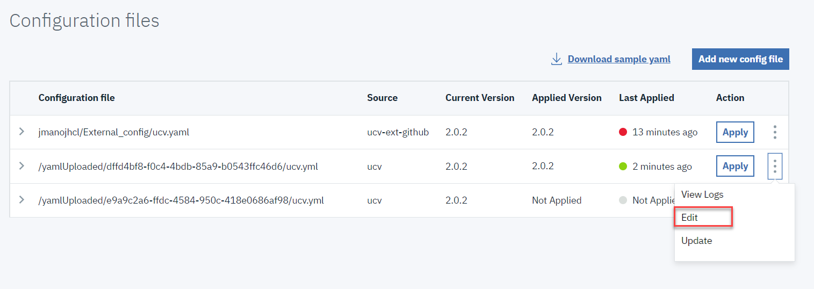
       The The existing YAML configuration file will download.
    3. The Edit the downloaded YAML configuration file.
    4. Click overflow menu of the YAML configuration file which you have edited and then click **Update**.
       Update config dialog opens.
    5. Click **Choose file** to select the edited file.

       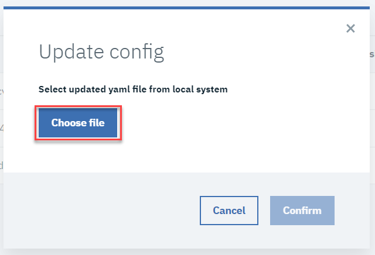
    6. Click **Confirm** to upload the file.  

       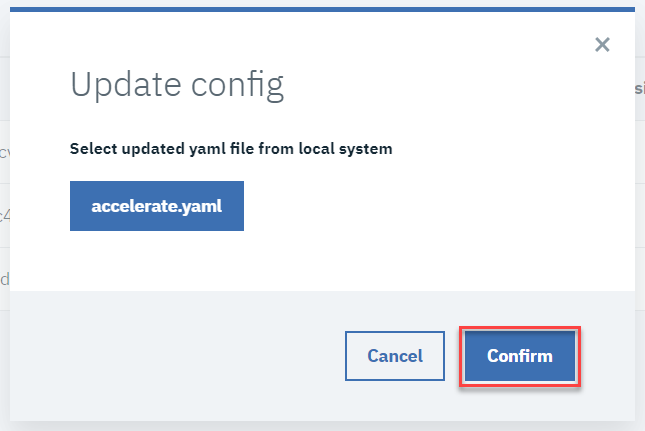  
    The updated YAML configuration file is displayed in the list.
    
## Applying YAML configuration file

Once you have the YAML configuration file in DevOps Velocity, perform the following steps to apply the configuration:

1. Log in to DevOps Velocity.
2. Click **Settings>External config pipeline**.
3. Choose the required YAML configuration file in the list and click right angle bracket to preview the configuration details.

    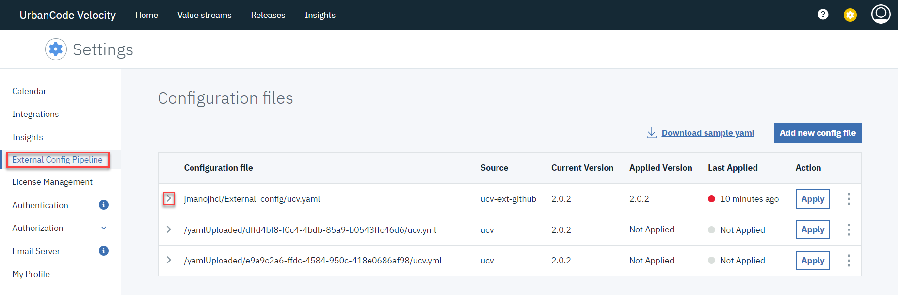 
5. Click **Apply** for the required YAML configuration file.
6. Click overflow menu for the required YAML configuration file and then click View Logs to view the logs of the applied YAML configuration file.  

   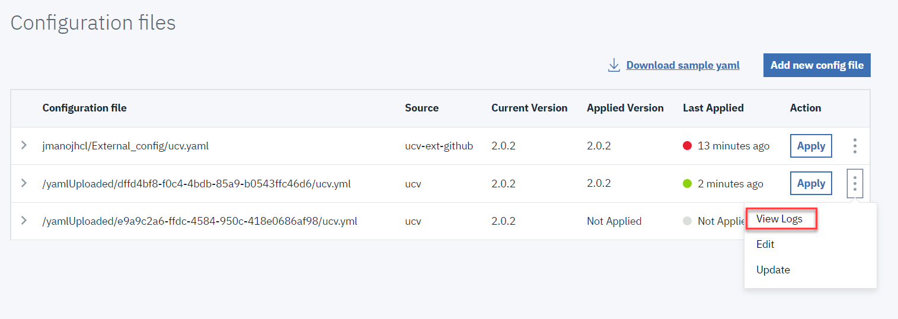 

## YAML configuration file properties

The YAML configuration file is used to define configuration settings for automating the initial setup process for integrating various CI/CD tools into DevOps Velocity.

### YAML File Structure

The following table describe the properties used to define the configuration in the YAML file.

|Property name |Type  |Description                          |Required|
|--------------|------|-------------------------------------|--------|
|version	   |String| The version number of YAML file.	|Yes     |	
|integrations  |Array | List of integration configurations. |Yes     |	

#### Integrations

The following table describe the properties that you must define under integrations:

|Property name|Type  |Description	                                   |Required|
|-------------|------|--------------------------------------------------|--------|
|type	     |String|Type or category of the CI/CD tool.	           |Yes     |
|attributes   |Object|Additional attributes specific to the integration.|Yes     |
|configs	  |Object|	Configuration object for the integration.	 |Yes     |

##### Configuration Object

The following table describe the properties that you must define under configs :

|Property name|Type  |Description	                               |Required|
|-------------|------|----------------------------------------------|--------|
|name	     |String|Name of the configuration.	                |Yes     |
|loggingLevel |String|Logging level for the integration.	        |Yes     |
|deltaTime	|String|Optional: Time difference for the integration.|Yes     |

For additional configuration properties depending on integration type, navigate to respective plug-in and look for general configuration properties section for more details.

### Sample YAML configuration file

Following is the sample YAML configuration file with existing integration.

```
version: "8.0.0"
integrations:
  - type: ucv-ext-launch
    name: Test
    attributes:
      auto-config: true
      application: [
         "Test1"
      ],
      appEnvOrder: ["QA", "DEV", "PROD"]
      integrationId: 12345678,
      team: Loop3
```

Replace the property values in the sample file with the actual values specific to your configuration.

#### Customizing YAML configuration file

Perform the following steps to customize the YAML configuration file for your required integrations:

1. Open the YAML configuration file in a text editor.
2. Update `version` property with the appropriate version number.
3. Under `integrations` property, add or remove any property as required.
4. For each integration, add `type`, `attributes`, and `configs` property. `name` is optional if we want to overwrite valuestream name.
5. In valuestream, To filter pipeline based on application add `applications` and `teams` to map value stream against the team.
6. Under `configs` property, you must add the required properties based on the integration type. if `integrationId` is specified then configs is optional.
7. To order the environment while syncing, use the `appEnvOrder` property.
8. Set the `auto-config` attribute to **true** for enabling automatic setup of pipeline applications processes and environments after creating a new integration.
9. Save the YAML configuration file.

|Back to ...||Latest Version|YAML Executor |||
| :---: | :---: | :---: | :---: | :---: | :---: |
|[All Plugins](../../index.md)|[Velocity Plugins](../README.md)|[0.0.13-File 1 ](https://raw.githubusercontent.com/UrbanCode/IBM-UCV-PLUGINS/main/files/ucv-ext-yaml-executor/ucv-ext-yaml-executor%3A0.0.13.tar.7z.001)[and 0.0.13-File 2](https://raw.githubusercontent.com/UrbanCode/IBM-UCV-PLUGINS/main/files/ucv-ext-yaml-executor/ucv-ext-yaml-executor%3A0.0.13.tar.7z.002)|[Readme](README.md)|[Overview](overview.md)|[Downloads](downloads.md)|
