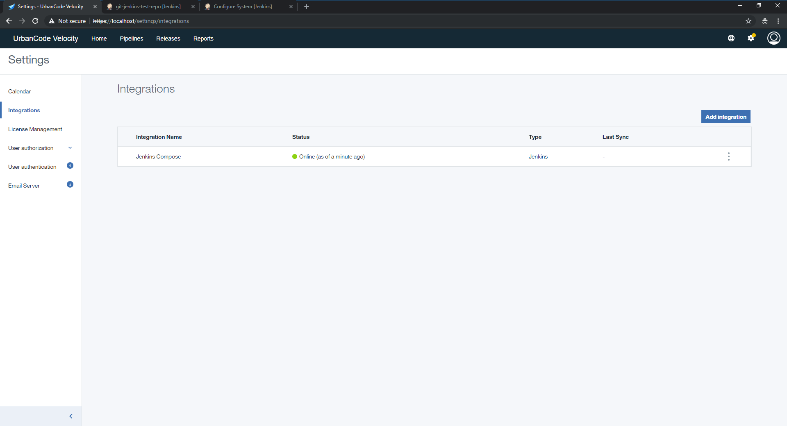
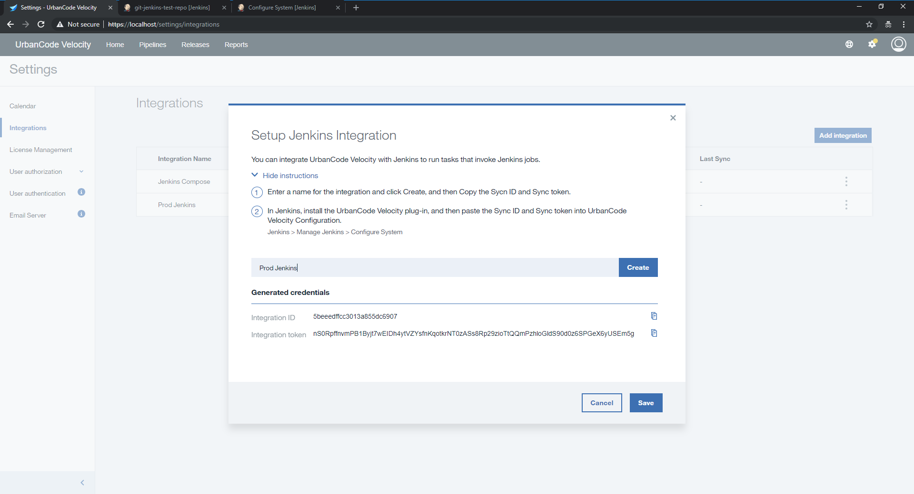
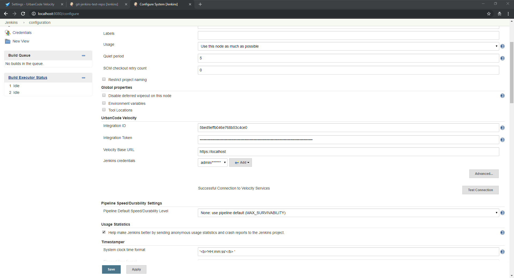

# Jenkins For DevOps Velocity - Usage

* **Posting job metadata to your DevOps Velocity instance** – As you create and edit jobs, the metadata for the jobs will uploaded including the names of the jobs as well as the names of parameters. This is done so that the jobs can be invoked from DevOps Velocity within the Velocity security model.

* **Invoke jobs from DevOps Velocity** – An authenticated, encrypted persistent connection is established with DevOps Velocity so that you can trigger off jobs and pipelines with no special firewall configuration.

* **Updates status of running jobs** – You will receive instant feedback in DevOps Velocity with links to the execution.

* **Job executions can create versions in the DevOps Velocity pipeline** – You will have the option to select Jenkins jobs as "input jobs" which will create a version with special properties that you can specify.

* **Detects quality data provided by IBM Deployment Risk Analytics** - If you use the capabilities found in the IBM Cloud DevOps plugin to provide data to IBM DRA, then this plugin will forward that data to your composite pipeline to visualize quality data across your whole suite of applications.

## Installation

Process steps for the Jenkins plugin includes the following:

1. Generate an **Integration Id** and **Integration Token**.
     
    Navigate to the **Settings Page** of DevOps Velocity and select the Integrations section in the left navigation. Create a new Jenkins integration.

    

    In the dialog box provide a logical name that represents the Jenkins instance that you are attempting to connect. This will generate an Integration Id and Integration Token pair. When the time comes this dialog provides "Copy to Clipboard" button on these fields.

    

2. Install this plugin on your Jenkins instance

    Navigate to the plugins page on your Jenkins instance by clicking **Manage Jenkins** > **Manage Plugins** > **Available (tab)** and search for DevOps Velocity Plugin. When located install the plugin and restart your instance when possible.

    If the plugin is not available in the Jenkins publically hosted plugins, please download [urbancode-velocity.hpi](http://public.dhe.ibm.com/software/products/UrbanCode/plugins/) and upload it to your Jenkins instance by navigating to the Advanced tab on the plugins page.

3. Populate Jenkins Configuration with **Integration Id**, **Integration Token**, and **Jenkins Credentials**

    Navigate to the Jenkins configuration page **Manage Jenkins** > **Configure System** > **DevOps Velocity (section)**. Under the DevOps Velocity section paste the Integration ID and Integration Token values from Step 1 above. Please add a credentials entry for a Jenkins user on whose behalf this plugin may access your Jenkins items. Please **Apply** or save the values before clicking the **Test Connection** button to confirm your connection to DevOps Velocity. Upon successful connection, your data will be posted to DevOps Velocity.

    

    **Note:** Jenkins integrations on Kubernetes/Openshift instances: When a user configures the DevOps Velocity plugin within Jenkins, they need to manually specify the "Rabbit MQ Port" in Jenkins (typically 31672) since the default value (5672) will not work.

## Manual build

To perform a manual build for the plugin directly from the GitHub repository, clone the repository from https://github.com/jenkinsci/urbancode-velocity-plugin

From the root directory, run either of the following commands:

* **mvn install**
* **mvn clean package -DskipTests** with the **-DskipTests** flag enabled to expedite the build without running tests

**Note**: The plugin requires **Java 8 or later**. To avoid potential errors, delete the **target** directory.


## Configuration properties

* Check gate in DevOps Velocity
* Upload Build to DevOps Velocity
* Upload Deployment to DevOps Velocity
* Upload JUnit Results to DevOps Velocity
* Upload JUnit Metrics File to DevOps Velocity

## Check gate in DevOps Velocity

The CheckGate class is used to check gates applied on a particular stage of the DevOps Velocity pipeline for a particular versionId of an application.

```
step($class: 'CheckGate',
pipelineId: "63a4591b-4d0d-4b8d-a6fb-4e9e7d79e754",
stageName: "DEV",
versionId: "NWZkOWUyZjYtOGE3Yy00NmJhLTlmZD-#48",
)

```
## Check gate input properties

| Name | Type | Description | Required | Property name |
| --- | --- | --- | --- | --- |
| Pipeline ID | String | Pipeline ID from DevOps Velocity. | Yes | pipelineId |
| Stage Name | String | Stage name of DevOps Velocity pipeline. | Yes | stageName |
| Version ID | String | Version Id for particular application. | Yes | versionId |

## Upload build to DevOps Velocity

The UploadBuild class is used to upload build data to DevOps Velocity. The revision parameter is important for linking the build to the work item via GitHub data (GIT_COMMIT in this case). The versionName is important for linking forward to deployments. The appName corresponds to the DevOps Velocity pipeline application name.

```
step($class: 'UploadBuild',
tenantId: "5ade13625558f2c6688d15ce",
revision: "${GIT_COMMIT}",
appName: "${VELOCITY_APP_NAME}",
versionName:"${currentBuild.displayName}",
requestor: "admin",
id: "${currentBuild.displayName}"
)

```
## Upload build input properties

| Name | Type | Description | Required | Property name |
| --- | --- | --- | --- | --- |
| Tenant ID | String | Tenant Id from DevOps Velocity | Yes | tenantId |
| Build Name | String | Build Name to display in DevOps Velocity | No | name |
| Version Name | String | For linking forward to deployments. | No | versionName |
| Requestor | String | Requestor Name to display in DevOps Velocity | No | requestor |
| Revision | String | For linking the build to the work item via GitHub data. | No | revision |
| Status | String | One of start, in_progress, success, or failure. | No | status |
| Start Time | String | Start time for this step (Default: CurrentTime). | No | startTime |
| End Time | String | EndTime for this step (Default: CurrentTime). | No | endTime |
| App Name (one of three required) | String | DevOps velocity pipeline application name. | No | appName |
| App ID (one of three required) | String | DevOps velocity pipeline application Id. | No | appID |
| App External ID (one of three required) | String | DevOps velocity pipeline application External Id. | No | appExtId |
| Debug | Boolean | For Getting debug logs. | No | debug |
| Fatal | Boolean | Fail build on failed upload, rather than just making build unstable. | No | fatal |

## Upload Deployment to DevOps Velocity

The UploadDeployment class is used to upload deployment data to DevOps Velocity. The versionName parameter is critical for linking to build data. The appName corresponds to the DevOps Velocity pipeline application name, while environmentName and environmentId are used to identify the deployment environment.

```
step([$class:
'UploadDeployment',
tenantId: "5ade13625558f2c6688d15ce",
versionName: "${currentBuild.displayName}",
versionExtId: "${currentBuild.displayName}",
type: 'Jenkins',
environmentId: "${VELOCITY_ENV_ID_DEV}",
environmentName: 'DEV',
appName: "${VELOCITY_APP_NAME}",
description: '[Description ex: Terraform Deployment]',
initiator: "admin",
result: 'true'
])

```
## Upload deployment input properties

| Name | Type | Description | Required | Property name |
| --- | --- | --- | --- | --- |
| Tenant ID | String | Tenant Id from DevOps Velocity | Yes | tenantID |
| Name | String | Name to display in DevOps Velocity | No | name |
| Result | String | One of start, in_progress, success, or failure. | No | result |
| Initiator | String | Initiator Name to display in DevOps Velocity | No | initiator |
| Version Name | String | For linking to build data. | No | versionName |
| Version External ID | String | For linking to build data. | No | versionExtID |
| Type | String | Type of deployment job. | yes | type |
| Environment Name | String | To identify the deployment environment. | No | environmentName |
| Environment ID | String | To identify the deployment environment. | No | environmentID |
| ID | String | Unique Id for step. | No | id |
| Description | String | Description of this step. | No | description |
| Start Time | String | Start time for this step (Deafault: CurrentTime). | No | startTime |
| End Time | String | EndTime for this step (Deafault: CurrentTime). | No | endTime |
| App Name (one of three required) | String | DevOps Velocity pipeline application name. | No | appName |
| App ID (one of three required) | String | DevOps Velocity pipeline application ID. | No | appId |
| App External ID (one of three required) | String | DevOps Velocity pipeline application external Id. | No | appExtId |
| Debug | Boolean | For Getting debug logs. | No | debug |
| Fatal | Boolean | Fail build on failed upload, rather than just making build unstable. | No | fatal |

## Upload JUnit Results to DevOps Velocity

| Type | Description | Required | Property name |
| --- | --- | --- | --- |
| java.util.Map <java.lang.String, java.lang.String> | Upload JUnit Results to DevOps Velocity | Yes | properties |

## Upload JUnit Metrics File to DevOps Velocity

The UploadMetricsFile class is used to upload metrics file into DevOps Velocity. The uploaded metrics file will be available in Insights in graphical form.

```
step($class: 'UploadMetricsFile',
tenantId: "5ade13625558f2c6688d15ce",
filePath: "junit.xml",
appName: "${VELOCITY_APP_NAME}",
name:"Junit",
dataFormat: "junitXML",
pluginType: "junitXML",
testSetName: "Junit",
metricsRecordUrl: "${env.BUILD_URL}",
buildUrl: "${env.BUILD_URL}",
)

```

## Upload metrics file input properties

| Name | Type | Description | Required | Property name |
| --- | --- | --- | --- | --- |
| Tenant ID | String | Tenant Id from DevOps Velocity | Yes | tenantId |
| Name | String | Name to display in DevOps Velocity | No | name |
| File Path | String | Path to metrics file | No | filePath |
| Test Set Name | String | Name to test set. | No | testSetName |
| Environment | String | Environment name to display in DevOps Velocity | Yes | environment |
| Combine Test Suites | Boolean |  | No | combineTestSuites |
| Fatal | Boolean | Fail build on failed upload, rather than just making build unstable. | No | fatal |
| Plugin Type | String | Plugin type for metrics file. | No | pluginType |
| Data Format | String | Data format of metrics file. | Yes | dataFormat |
| Record Name | String | Record Name to display in DevOps Velocity | No | recordName |
| Metric Definition ID | String | Metric Definition ID from DevOps Velocity | No | metricDefinitionId |
| Description | String | Description of this step. | No | description |
| Execution Date | String | Time of execution that produced test results. Should be in Epoch milliseconds. Defaults to current time. | No | executionDate |
| Build ID | String | Build ID to display in DevOps Velocity | No | buildId |
| App Name (one of three required) | String | DevOps Velocity pipeline application name. | No | appName |
| App ID (one of three required) | String | DevOps Velocity pipeline application id. | No | appId |
| App External ID (one of three required) | String | DevOps Velocity pipeline application external id. | No | appExtId |

## License

Copyright© 2016, 2017 IBM Corporation

Permission is hereby granted, free of charge, to any person obtaining a copy of this software and associated documentation files (the "Software"), to deal in the Software without restriction, including without limitation the rights to use, copy, modify, merge, publish, distribute, sublicense, and/or sell copies of the Software, and to permit persons to whom the Software is furnished to do so, subject to the following conditions:

The above copyright notice and this permission notice shall be included in all copies or substantial portions of the Software.

THE SOFTWARE IS PROVIDED "AS IS", WITHOUT WARRANTY OF ANY KIND, EXPRESS OR IMPLIED, INCLUDING BUT NOT LIMITED TO THE WARRANTIES OF MERCHANTABILITY, FITNESS FOR A PARTICULAR PURPOSE AND NONINFRINGEMENT. IN NO EVENT SHALL THE AUTHORS OR COPYRIGHT HOLDERS BE LIABLE FOR ANY CLAIM, DAMAGES OR OTHER LIABILITY, WHETHER IN AN ACTION OF CONTRACT, TORT OR OTHERWISE, ARISING FROM, OUT OF OR IN CONNECTION WITH THE SOFTWARE OR THE USE OR OTHER DEALINGS IN THE SOFTWARE.


|Back to ...||Latest Version|urbancode-velocity |||
| :---: | :---: | :---: | :---: | :---: | :---: |
|[All Plugins](../../index.md)|[Velocity Plugins](../README.md)|[3.0.1](https://github.com/jenkinsci/urbancode-velocity-plugin/releases/download/3.0.1/urbancode-velocity-3.0.1.hpi)|[Readme](README.md)|[Overview](overview.md)|[Downloads](downloads.md)|
